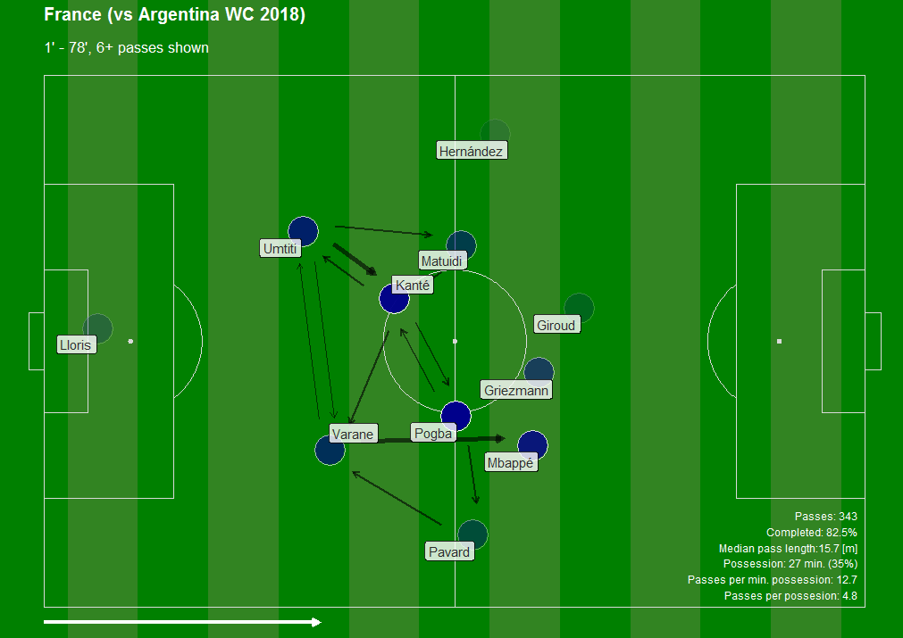
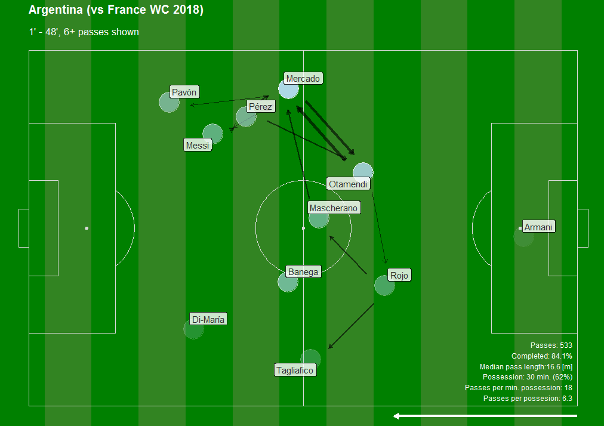
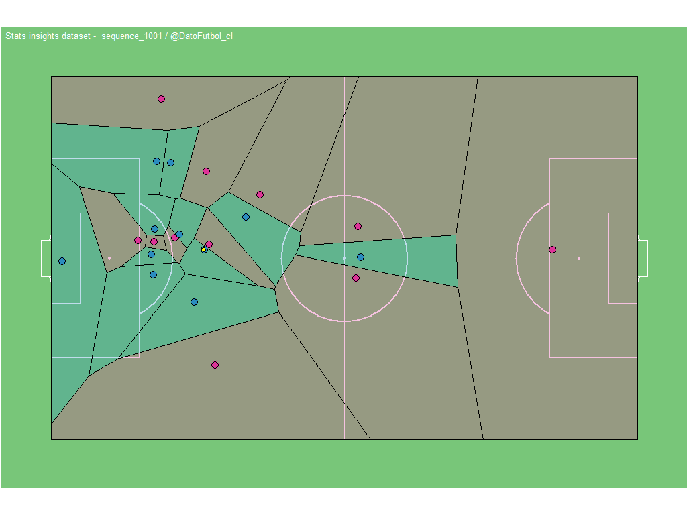

### Dato Fútbol

This is the new repository of **Dato Fútbol**
(The previous repository here: https://github.com/Bustami/DatoFutbol)

**DATO FUTBOL** is a project focused on getting a deeper knowledge in the field of Football Analytics. This way I've been developing different resources related to, like [**this blog**](http://datofutbol.cl).

##### Another resources here:

* A [**Twitter**](https://twitter.com/DatoFutbol_cl) account.

* Conferences :

1) [**Una mirada al Soccer Analytics usando R**](http://datofutbol.cl/satRdaySCL2018-soccer-analytics-R/index.html)

2) [**La revolución de los datos en Soccer Analytics**](http://datofutbol.cl/revolucion-datos-soccer-analytics-seminario-UAI-2019/)

* Another articles about using R for Soccer Analytics (Medium):

[**Part I**](https://medium.com/datos-y-ciencia/una-mirada-al-soccer-analytics-usando-r-parte-i-ab6b704b4c7f)

[**Part II**](https://medium.com/datos-y-ciencia/una-mirada-al-soccer-analytics-usando-r-parte-ii-5aadb0ff6ab2)

[**Part III**](https://medium.com/@ismaelgomezs/una-mirada-al-soccer-analytics-usando-r-parte-iii-3bdff9cd3752)

## Examples

Considering 3 data categories: A) Historical data, B) Event data & C) Tracking data, here some examples:

#### 1) Historical data

*Champions ranking

#### 2) Event data

*Shotmap

*Passing Networks

#### 3) Tracking data

Animation with Voronoi diagrams ([code in Github](https://github.com/Bustami/DatoFutbol/tree/master/TrackingDataTest)):

If you have any question or request don't hesitate to contact me by email:
##### ismaelgomezs@gmail.com

Enjoy it!
